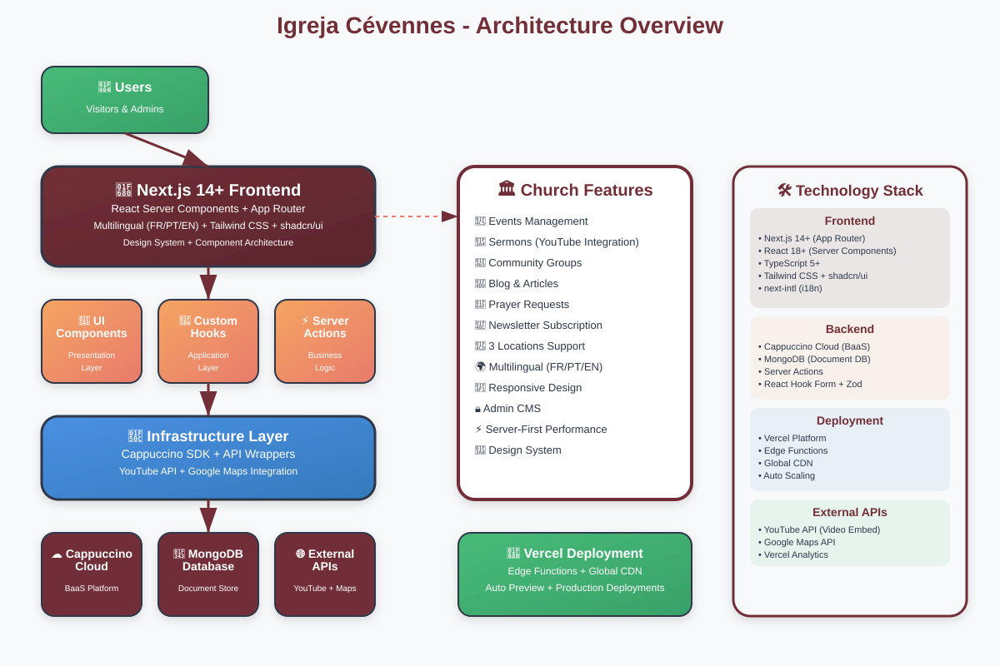

# Architecture Diagram - Igreja Cévennes

> Diagrama visual da arquitetura (Frontend → Cappuccino → MongoDB)
> Baseado em `project_guidelines.json` e Clean Architecture pragmática

---

## 🏛️ Visão Geral da Arquitetura



*Diagrama completo mostrando o fluxo de dados desde os usuários até o MongoDB, passando pelas 4 camadas da Clean Architecture.*

---

## 📋 Legenda do Diagrama

### 🎯 **Camadas Principais**

1. **👤 Users Layer** - Visitantes do site e administradores do CMS
2. **🚀 Frontend Layer** - Next.js 14+ com React Server Components 
3. **🔄 Application Layer** - UI Components, Hooks customizados e Server Actions
4. **🔌 Infrastructure Layer** - Cappuccino SDK e wrappers de APIs externas
5. **☁️ External Services** - Cappuccino Cloud, MongoDB e APIs externas

### 🎨 **Códigos de Cores**

- **Borgonha (#722F37)** - Frontend Next.js e External Services
- **Marigold/Coral (#F5A462)** - Application Layer (lógica de aplicação)
- **Azul (#4A90E2)** - Infrastructure Layer (infraestrutura)
- **Verde (#48BB78)** - Users e Deployment (início e fim do fluxo)

## 🔄 Fluxo de Dados da Aplicação

### Cenário 1: Visitante visualiza eventos

```
User → Next.js Page → useEvents Hook → Server Action → Cappuccino SDK → MongoDB
                                                    ↓
User ← Rendered UI ← Events Data ← Response ← Query Results ← Collections
```

### Cenário 2: Admin cria novo evento  

```
Admin → Form Submit → Server Action → Validation (Zod) → Cappuccino SDK → MongoDB
                                                       ↓
Admin ← Success UI ← Revalidated Cache ← Success Response ← Insert Confirmation
```

### Cenário 3: YouTube sermon playback

```
User → Sermon Page → YouTubeEmbed Component → YouTube API → Video Stream
                                          ↓
User ← Video Player ← Embedded Player ← API Response ← YouTube Servers
```

---

## 🎨 Design System Integration

O diagrama também mostra como o **Design System** se integra em todas as camadas:

- **Tokens de Cor**: Borgonha primary (#722F37) usado em toda interface
- **Componentes UI**: shadcn/ui como base + componentes customizados  
- **Typography**: Playfair Display (serif) + Inter (sans-serif)
- **Spacing**: Rhythm visual baseado em múltiplos de 8px
- **Responsividade**: Mobile-first approach em todos componentes

---

## � Features & Funcionalidades

O diagrama destaca as principais **features da igreja**:

- **📅 Events Management** - Sistema completo de gerenciamento de eventos
- **🎤 Sermons** - Integração com YouTube para pregações  
- **👥 Community Groups** - Gestão de grupos e ministérios
- **📝 Blog & Articles** - Sistema de publicação de conteúdo
- **🙏 Prayer Requests** - Lista de pedidos de oração
- **💌 Newsletter** - Sistema de inscrição em newsletter
- **📍 3 Locations** - Suporte às 3 localizações da igreja
- **🌍 Multilingual** - Suporte completo FR/PT/EN
- **📱 Responsive** - Design responsivo mobile-first
- **🔒 Admin CMS** - Backoffice para gestão de conteúdo

---

## 🛠️ Stack Tecnológico Detalhado

### Frontend Stack
- **Next.js 14+** - Framework React com App Router
- **React 18+** - Server & Client Components  
- **TypeScript 5+** - Type safety
- **Tailwind CSS** - Utility-first CSS framework
- **shadcn/ui** - Component library base
- **next-intl** - Internationalization

### Backend & Infrastructure
- **Cappuccino Cloud** - Backend-as-a-Service
- **MongoDB** - Document database
- **Server Actions** - API layer nativo do Next.js
- **React Hook Form + Zod** - Forms com validação

### Deployment & Performance
- **Vercel Platform** - Deployment e hosting
- **Edge Functions** - Processamento distribuído
- **Global CDN** - Assets distribuídos globalmente
- **Auto Scaling** - Escalabilidade automática

### External Integrations
- **YouTube API** - Embed de vídeos/pregações
- **Google Maps API** - Localização das 3 igrejas
- **Vercel Analytics** - Monitoramento de performance

---

## 🎯 Principais Benefícios Arquiteturais

### ✅ **Performance**
- **Server-First Rendering** - Reduz JavaScript no cliente
- **Incremental Static Regeneration** - Conteúdo sempre atualizado
- **Edge Caching** - Latência mínima globalmente
- **Code Splitting** - Carrega apenas o necessário

### 🔧 **Manutenibilidade** 
- **Clear Separation of Concerns** - Cada camada tem responsabilidade única
- **Feature-based Structure** - Organização escalável por domínio
- **TypeScript** - Type safety em todo codebase
- **Component-driven** - Reutilização e consistência

### 🚀 **Escalabilidade**
- **Serverless Architecture** - Scaling automático
- **Modular Components** - Fácil extensão de funcionalidades  
- **Clean Architecture** - Adição de features sem quebrar existentes
- **External API Abstraction** - Fácil troca de serviços

### 👥 **Developer Experience**
- **Modern Tooling** - TypeScript + ESLint + Prettier
- **Clear Patterns** - Guidelines bem definidos
- **Hot Reload** - Desenvolvimento rápido
- **Documentation** - Arquitetura bem documentada

---

## 📊 Métricas de Sucesso

### 🎯 **Performance Targets**
- **Lighthouse Score** ≥ 95 (Performance, Accessibility, SEO, Best Practices)
- **Core Web Vitals** ≤ 2.5s LCP, ≤ 100ms FID, ≤ 0.1 CLS  
- **First Contentful Paint** ≤ 1.5s
- **Time to Interactive** ≤ 3s on 3G

### 📱 **User Experience**
- **Mobile-First** - Perfeita experiência em dispositivos móveis
- **Accessibility** - WCAG 2.1 AA compliance
- **SEO Optimized** - Meta tags, structured data, sitemap
- **Offline-Ready** - Service worker para funcionalidades básicas

### 🔒 **Security & Reliability**
- **HTTPS Everywhere** - TLS 1.3
- **Input Validation** - Client + Server validation
- **Error Boundaries** - Graceful error handling
- **Monitoring** - Error tracking e performance monitoring

---

## 📚 Documentação Relacionada

- [project_guidelines.json](./project_guidelines.json) - Guidelines arquiteturais completos
- [project-structure.md](./project-structure.md) - Estrutura detalhada de pastas
- [design-system.md](./design-system.md) - Sistema de design visual
- [Next.js Documentation](https://nextjs.org/docs) - Framework oficial docs
- [Clean Architecture](https://blog.cleancoder.com/uncle-bob/2012/08/13/the-clean-architecture.html) - Princípios arquiteturais

---

*Este diagrama serve como referência visual central para entender a arquitetura completa do projeto Igreja Cévennes, seus fluxos de dados, tecnologias e princípios de design.*